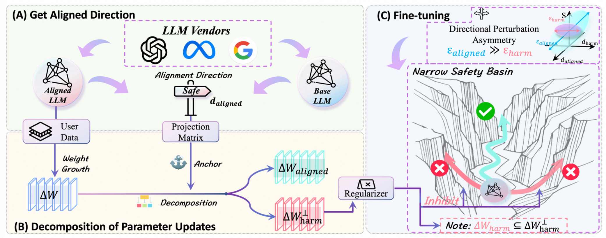

### 🎯 Method Overview


<p align="center">
    
</p>
<p align="center" style="font-size: 14px; font-style: italic;">
    Figure 1: The Orbit framework decomposes parameter updates into safety-aligned (d<sub>aligned</sub>) and orthogonal components, suppressing harmful updates via subspace regularization.
</p>

**Key Idea**:  
Orbit leverages the **alignment direction** (weight difference between safety-aligned and base models) as an anchor. By decomposing parameter updates and constraining orthogonal components through a novel regularization term, it ensures fine-tuning remains within the "narrow safety basin", achieving both **strong safety preservation** and **task performance**.

---

### 🛠️ Setup

### Environment Configuration
```bash
# Create conda environment
conda create -n Orbit python=3.9
conda activate Orbit
cd Orbit 

# Install dependencies
pip install -r requirements.txt
```

### Model Preparation
```bash
# Create model storage directory (if needed)
mkdir -p ckpts/
```

| Model               | HuggingFace Link                                  | Notes                        |
|---------------------|--------------------------------------------------|------------------------------|
| Llama-2-7B-Chat     | TheBloke/Llama-2-7B-Chat-fp16                    | Safety-aligned model         |
| Llama-2-7B-base     | meta-llama/Llama-2-7b-hf                         | Base model      |
| Beaver-Dam-7B       | PKU-Alignment/beaver-dam-7b                      | Safety evaluation model      |

> **Note**: Download the models listed in the table above to the ckpts/ folder.


### Directory Structure
```bash
Orbit/
├── ckpts/
│   ├── Llama-2-7B-Chat-fp16/
│   ├── Llama-2-7b-hf/
│   └── beaver-dam-7b/
├── configs/
├── ft_datasets/
└── ... (other project folders)
```

⚠️ Important Notes:
- Llama-2 models require access approval on HuggingFace
- All models should be placed under ckpts/
- Use exact folder names as shown above

---

## 🚀 Training

### Running Fine-tuning
Training scripts are organized by dataset under `scripts/`, supporting:  
**Agnews**, **Alpaca**, **GSM8K**, **SST2**

#### Basic Training Commands
```bash
# For Agnews dataset (default 1k_p_0.1 mode)
bash scripts/agnews/Orbit_reg1_p_0.1.sh > finetuned_logs/agnews/Orbit_reg1_p_0.1.log 2>&1 &

# Other datasets
bash scripts/alpaca/Orbit_reg1_p_0.1.sh > finetuned_logs/alpaca/Orbit_reg1_p_0.1.log 2>&1 &
bash scripts/gsm8k/Orbit_reg1_p_0.1.sh > finetuned_logs/gsm8k/Orbit_reg1_p_0.1.log 2>&1 &
bash scripts/SST2/Orbit_reg1_p_0.1.sh > finetuned_logs/SST2/Orbit_reg1_p_0.1.log 2>&1 &
```

#### Experimental Modes
Configure training via `--mode` parameter:
> **Note**: You can modify the `--mode` parameter in the `.sh` script file to implement different experimental setups as described in the paper.

| Mode         | Description                           |
|--------------|---------------------------------------|
| `1k_p_0`     | 1k samples, 0% harmful data          |
| `1k_p_0.05`  | 1k samples, 5% harmful data          |
| `1k_p_0.1`   | 1k samples, 10% harmful data (default)|
| `1k_p_0.15`  | 1k samples, 15% harmful data         |
| `1k_p_0.2`   | 1k samples, 20% harmful data         |
| `0.5k_p_0.1` | 500 samples, 10% harmful data        |
| `1.5k_p_0.1` | 1500 samples, 10% harmful data       |
| `2k_p_0.1`   | 2000 samples, 10% harmful data       |
| `2.5k_p_0.1` | 2500 samples, 10% harmful data       |

---
## 📊 Evaluation

### Poison Evaluation (Safety Assessment)
```bash
cd evaluation/poison_evaluation

# Run for Agnews
bash scripts/agnews/eval_agnews.sh > scripts/agnews/eval_agnews.log 2>&1 &

# Other datasets
bash scripts/alpaca/eval_alpaca.sh > scripts/alpaca/eval_alpaca.log 2>&1 &
bash scripts/gsm8k/eval_gsm8k.sh > scripts/gsm8k/eval_gsm8k.log 2>&1 &
bash scripts/SST2/eval_SST2.sh > scripts/SST2/eval_SST2.log 2>&1 &
```

### Utility Evaluation (Task Performance)

```bash
# For Agnews
cd evaluation/utility_evaluation/agnews
bash scripts/eval.sh > scripts/eval.log 2>&1 &

# For GSM8K/SST2
cd ../gsm8k && bash scripts/eval.sh
cd ../SST2 && bash scripts/eval.sh

# Alpaca requires LLM-Judge
cd ../alpaca
# Follow instructions in the directory's README.md
```
---
## 📂 Project Structure
```bash
Orbit/
├── ckpts/                     # Model checkpoints
├── configs/                   # Training configurations
├── evaluation/
│   ├── poison_evaluation/     # Safety assessment scripts
│   └── utility_evaluation/    # Task performance evaluation
├── finetuned_logs/            # Training logs
├── finetuned_models/          # Fine-tuned model outputs
├── ft_datasets/               # Processed datasets
├── images/                    # Figures for documentation
├── scripts/
│   ├── agnews/                # Dataset-specific scripts
│   ├── alpaca/
│   ├── gsm8k/
│   └── SST2/
├── utils/                     # Utility functions
├── LICENSE
└── requirements.txt
```

---


## 🙏 Acknowledgment

This repository is built upon the following open-source projects:  
- **[LLMs-Finetuning-Safety](https://github.com/LLM-Tuning-Safety/LLMs-Finetuning-Safety)**  
- **[SafeLoRA](https://github.com/IBM/SafeLoRA)**  
- **[Booster](https://github.com/git-disl/Booster)**  
- **[llm-landscape](https://github.com/poloclub/llm-landscape)** (for safety landscape visualization)

We sincerely thank the authors of these projects for their foundational contributions. Their work provided critical inspiration and technical references for this research. Special thanks to the LLM safety community for driving innovation in this field.

---
